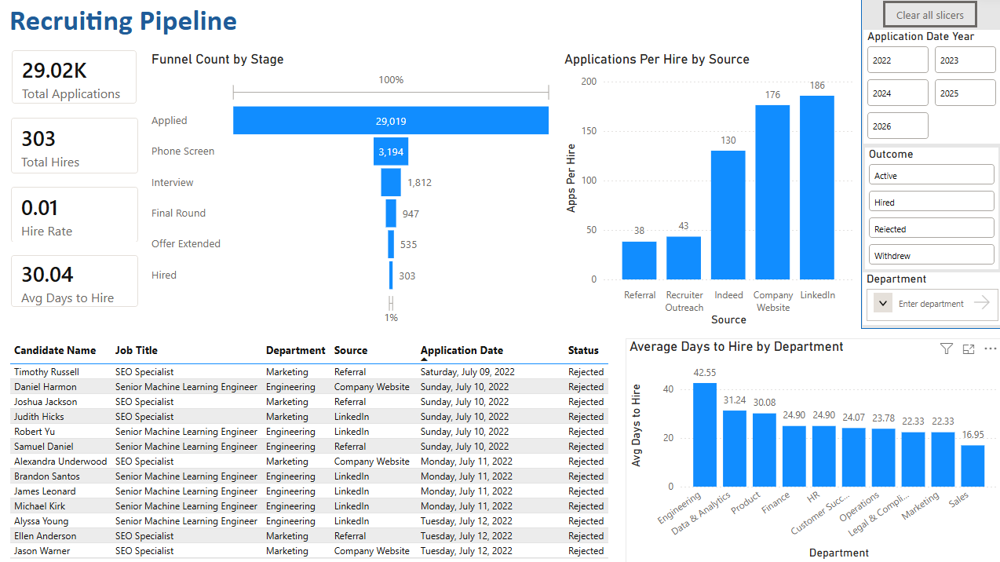
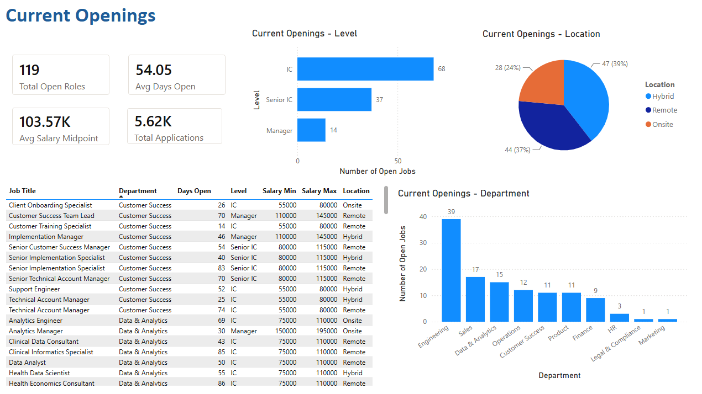

# Vantage Health — HR Recruiting Analytics
An end-to-end HR analytics pipeline built on synthetic but realistic 
Applicant Tracking System (ATS) data for a fictional healthcare analytics 
SaaS company, Vantage Health. The project simulates how recruiting data 
flows from a source system through a data warehouse to a business 
intelligence dashboard used by recruiters day-to-day. Real recruiting 
data is proprietary and confidential, so synthetic data was generated 
to reflect realistic ATS export patterns including messy source labels, 
missing fields, and funnel drop-off rates based on industry norms.

## Business Questions

1. **Which candidate source drives the most hires?** — Referral is widely known in recruiting as a high-quality source of candidates. This project includes hypothesis testing to determine whether candidate source impacts rate of hiring for candidates and quantifies the efficiency gap in sources like online job boards.
2. **How long does it take to hire across departments?** — We examine how long different departments take to complete the recruiting pipeline from initial application to offer acceptance.
3. **How can recruiters keep their pipeline organized?** — Recruiting 
   involves large volumes of messy, inconsistent data across many open roles. 
   The dashboard gives recruiters a single view of their active pipeline, 
   open roles, and key metrics.

## Tech Stack

- **Python** — synthetic ATS data generation, data cleaning, 
  chi-square hypothesis testing, SQLAlchemy data loading
- **PostgreSQL** — two-schema architecture (raw + clean), indexes, 
  reporting views
- **Power BI** — two-page recruiting dashboard with Row Level Security for recruiters from different parts of the company

## Key Findings

**Hypothesis test — does candidate source affect hire rate?**
Chi-square test on 26,143 completed applications (Active candidates 
excluded as outcomes unknown): source significantly affects hire rate 
(p < 0.0001). Null hypothesis rejected.

Pairwise chi-square tests with Bonferroni correction (threshold p < 0.005) 
identified two distinct performance groups:

| Source | Hire Rate | Apps per Hire |
|--------|-----------|---------------|
| Referral | 2.9% | ~34 |
| Recruiter Outreach | 2.6% | ~38 |
| Indeed | 0.9% | ~111 |
| Company Website | 0.6% | ~158 |
| LinkedIn | 0.6% | ~167 |

Referral and Recruiter Outreach are not significantly different from 
each other but both significantly outperform all job board sources. 
LinkedIn, Indeed, and Company Website are not significantly different 
from each other.

**Recruiter efficiency:** LinkedIn requires ~5x more applications 
processed per hire than Referral — a meaningful cost in recruiter time 
at scale, and an impetus to incentivize employee referrals.

**Time to hire by department:**
Engineering takes longest at ~42 days vs Sales at ~17 days, consistent 
with the industry expectation that technical roles require more interview 
rounds and coordination.

## Dashboard

**Page 1 — Recruiting Pipeline**
Funnel visualization showing candidate drop-off at each stage, hire rate 
and applications-per-hire by source, time to hire by department, and an 
active candidate pipeline table. Filterable by department, outcome, and year.

**Page 2 — Open Roles**
Current open requisitions with days open, salary ranges, and breakdown 
by department, level, and location. Provides recruiters a real-time view 
of what's actively being hired for.

**Row Level Security:**
- Tech Recruiter — Engineering, Data & Analytics, Product
- Commercial Recruiter — Sales, Marketing, Customer Success
- Corporate Recruiter — Finance, HR, Legal & Compliance, Operations
- Head of Talent — full visibility across all departments

## Project Structure
recruiting_analytics/
python/
01_generate_data.ipynb # synthetic ATS data generation
02_analysis.ipynb # cleaning, EDA, hypothesis testing
sql/
01_schema.sql # raw + clean schema definitions
02_indexes.sql # query performance indexes
03_views.sql # reporting views for Power BI
data/ # generated CSVs (gitignored)
README.md
requirements.txt

## Key Design Decisions

- **Synthetic data generation** — real ATS data is proprietary so data 
  was generated to reflect realistic recruiting patterns: weighted funnel 
  drop-off rates, department-specific time-to-hire, source quality 
  differentials, and deliberate messiness (inconsistent source labels, 
  missing rejection reasons) to simulate real export quality.
- **Two-schema architecture** — raw schema stores data exactly as received; 
  clean schema stores standardized validated data. Raw data is never 
  overwritten, reflecting production data warehouse patterns where source 
  data is preserved for auditability and reprocessing.
- **Chi-square with Bonferroni correction** — overall test confirms source 
  matters; pairwise tests identify specifically which sources differ. 
  Bonferroni correction controls for false positives across 10 pairwise 
  comparisons.
- **Static RLS with bidirectional filtering** — recruiters see only their 
  own department pipeline. RLS is defined on the pipeline view and 
  propagates to the open roles view via a bidirectional relationship — 
  a pattern that required troubleshooting Power BI's security filter 
  propagation behavior.
- **Active candidates excluded from hypothesis test** — candidates on 
  open roles with no final outcome were excluded from the chi-square test, 
  consistent with how completed requisition analysis is done in practice.
- **Refreshable pipeline** — the two-notebook architecture is designed 
  for periodic refresh. Re-running `01_generate_data.ipynb` simulates 
  a new ATS data pull, and `02_analysis.ipynb` cleans and reloads to 
  the clean schema. In production this would be automated via a 
  scheduler (e.g. Airflow, dbt) on a nightly or weekly cadence.

## How to Run

0. Clone this repo: `git clone https://github.com/m-r-horan/recruiting-analytics.git`
1. Install PostgreSQL and create database `recruiting_analytics`
2. Run `sql/01_schema.sql` to create raw and clean schemas
3. Run `sql/02_indexes.sql` and `sql/03_views.sql`
4. Create a `.env` file with `DB_PASSWORD=yourpassword`
5. Install dependencies: `pip install -r requirements.txt`
6. Run `python/01_generate_data.ipynb` to generate and load raw data
7. Run `python/02_analysis.ipynb` to clean data and run hypothesis test

